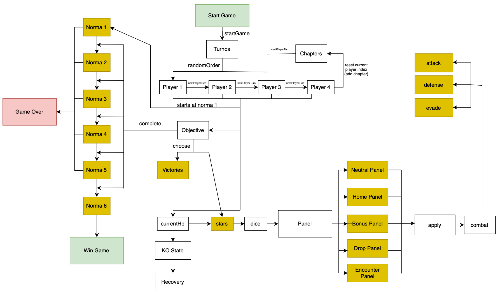

# 99.7% Citric Liquid

## About

`99.7% Citric Liquid` is a simplified clone of the renowned game, `100% Orange Juice`. Its main
purpose is to serve as an educational tool, teaching foundational programming concepts.

📢 **Note**: This project is purely educational and will not be used for any commercial purposes.

---

## For Students

The remainder of this README is yours to complete. Take this opportunity to describe your
contributions, the design decisions you've made, and any other information you deem necessary.

### Tarea 3

### Diagrama de estados

### Implemented functionalities
The functionalities implemented were the following:

- A Game Controller that manages the game flow and the players.
- The state pattern was used to manage the game flow.
- The observer pattern was used to notify the players of the game state, specifically when a player reaches a norma 6.

### Design decisions
The design decisions of the norma were done thinking
that the levels can't be skipped, meaning that if the character 
has the stars to level up from a Norma1 to a Norma3, for example, 
it will not level up to Norma3, but to Norma2.

### Code Organization
The code is organized following MVC, but the view is not fully implemented.

### Design Patterns
The design patterns used are the State Pattern and Observer Pattern.

    

This project is licensed under the [Creative Commons Attribution 4.0 International License](http://creativecommons.org/licenses/by/4.0/).

---